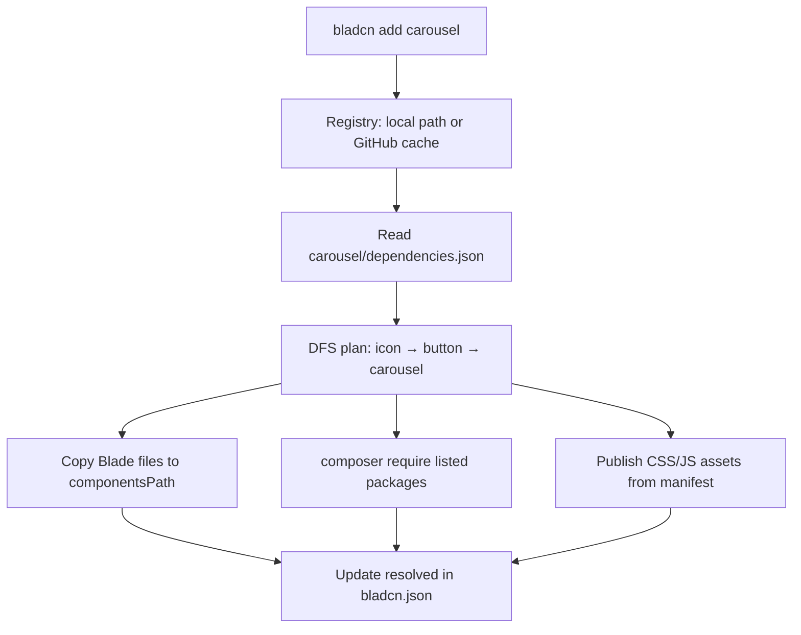

# AGENTS.md

Guide for AI agents working on **bladcn-cli** (`ailuracode/bladcn`).

## What this repository is

CLI package to install [shadcn/ui](https://ui.shadcn.com)-style **Blade + Alpine** components into Laravel projects. It copies files from an external **component registry** (default: [bladcn-components](https://github.com/AiluraCode/bladcn-components)) and resolves transitive dependencies from each `dependencies.json`.

- **This repo:** installer, registry client, Laravel Artisan commands, init stubs publisher
- **Not this repo:** Blade components, CSS tokens, or JS helpers (those live in **bladcn-components**)

## Layout

```
bladcn-cli/
├── bin/bladcn                    # Standalone Symfony Console entrypoint
├── config/bladcn.php             # Laravel package defaults (BLADCN_* env)
├── resources/bladcn.schema.json  # JSON Schema for bladcn.json
├── src/
│   ├── Application.php           # Console kernel
│   ├── Commands/                 # init, list, add, remove
│   ├── Config/BladcnConfig.php   # bladcn.json load/save
│   ├── Installer/                # copy, assets, composer, remove
│   ├── Laravel/                  # Artisan commands + service provider
│   ├── Registry/                 # registry I/O + dependency graph
│   ├── Services/                 # InitService, StubsPublisher, ProviderRegistrar
│   └── Support/                  # ClassResolver, Toast, AsChild*, helpers
└── tests/fixtures/registry/      # Minimal registry for PHPUnit
```

## How components are resolved

Resolution is **declarative** via `dependencies.json` in the registry plus `resolved` in the host project's `bladcn.json`.

### Registry (`Registry`)

1. Resolve registry root from `bladcn.json` → local path, `github:owner/repo`, GitHub URL, or `package:ailuracode/bladcn`
2. Find components under `resources/views/components/ui/` or `components/`
3. Load `dependencies.json` from component folders via `ComponentManifest`

### Install plan (`ComponentInstaller`)

Depth-first traversal of `dependencies` produces an ordered plan (dependencies before dependents). Example: `carousel` with `["button", "icon"]` → `icon` → `button` → `carousel`.

### Side effects on install

| Step | Class | Action |
|---|---|---|
| Copy Blade | `ComponentInstaller` | Folder or `.blade.php` → `componentsPath`; skip `dependencies.json` |
| Composer | `ExternalDependencyManager` | `composer require` for manifest `composer` entries |
| CSS/JS | `ComponentAssetManager` | Copy assets, patch `app.css` / `bladcn.js` imports |
| State | `BladcnConfig` | Merge installed names into `resolved` |

### Remove (`ComponentRemover`)

Uses `DependencyResolver` to find orphan internal components, Composer packages, and CSS/JS assets no longer required by any entry in `resolved`.



## Key classes

| Class | Role |
|---|---|
| `BladcnConfig` | `bladcn.json` I/O, paths, registry parsing |
| `Registry` | List components, read manifests, resolve source paths |
| `ComponentManifest` | Parse `dependencies.json` |
| `DependencyResolver` | Transitive deps, asset/composer aggregation, orphan detection |
| `ComponentInstaller` | Install plan + copy + persist `resolved` |
| `ComponentAssetManager` | Publish/remove CSS and JS assets |
| `ComponentRemover` | Uninstall + orphan cleanup |
| `InitService` | Create `bladcn.json` and publish stubs from registry |

## Development setup

```bash
composer install
cp .env.example .env   # BLADCN_REGISTRY=../bladcn-components

# Run tests (phpunit + pint + rector + phpstan)
composer test
```

PHPUnit uses `tests/fixtures/registry/` as a minimal local registry. For full integration, clone **bladcn-components** next to this repo.

## Code quality

Aligned with [laravel-starter-kit](https://github.com/nunomaduro/laravel-starter-kit): Pint (strict), Larastan max level, Rector (`rector-laravel`).

```bash
composer lint         # rector + pint (apply)
composer test         # phpunit + lint check + phpstan
composer test:unit    # phpunit only
composer test:lint    # pint --test + rector --dry-run
composer test:types   # phpstan
```

PHP conventions: `declare(strict_types=1);`, prefer `final readonly class` where Rector applies `ReadOnlyClassRector`, constructor property promotion.

## Rules for agents

### Do

- Keep changes minimal and focused on the requested behavior.
- Match existing patterns in `Commands/`, `Installer/`, and `Registry/`.
- Update tests under `tests/` when changing install/remove/resolution logic.
- Update `README.md` / `AGENTS.md` when architecture or public behavior changes.
- Run `composer test` before finishing.

### Don't

- Do not add Blade components here — they belong in **bladcn-components**.
- Do not break `bladcn.json` schema (`resources/bladcn.schema.json`).
- Do not copy `dependencies.json` into host projects (installer explicitly skips it).
- Do not create commits or PRs unless explicitly asked.
- Do not modify `vendor/`.

### Adding installer behavior

1. Implement in `Installer/` or `Registry/` with a focused class.
2. Wire through `Commands/` and `Laravel/Commands/` if user-facing.
3. Add PHPUnit coverage using `tests/fixtures/registry/`.
4. Document manifest fields or CLI flags in `README.md`.

## Related repositories

| Repo | Role |
|---|---|
| [AiluraCode/bladcn-components](https://github.com/AiluraCode/bladcn-components) | Component registry (Blade, CSS, JS, stubs) |
| [AiluraCode/bladcn-cli](https://github.com/AiluraCode/bladcn-cli) | This package (`ailuracode/bladcn` on Packagist) |

## License

MIT
