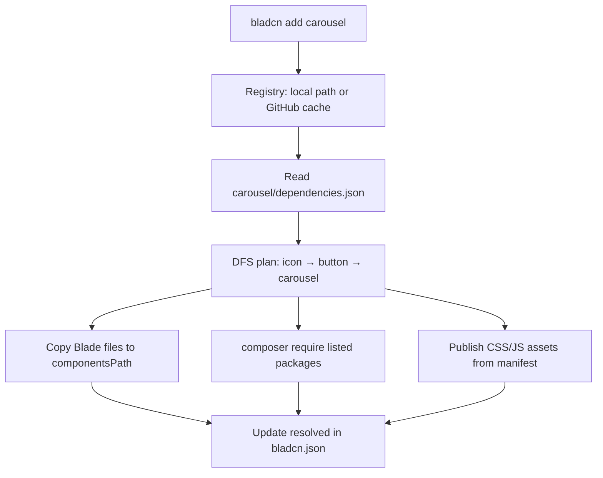

# bladcn CLI

[shadcn/ui](https://ui.shadcn.com)-style CLI to install Blade + Alpine components in Laravel projects.

Copies components from [bladcn-components](https://github.com/ailuracode/bladcn-components) (CSS, JS, Blade) and resolves dependencies from each `dependencies.json`.

### Registry layout (`bladcn-components`)

```
bladcn-components/
├── app/Providers/             # BladcnServiceProvider (bladcn init)
├── resources/
│   ├── js/                    # bladcn.js + carousel (import from app.js)
│   ├── css/                   # Theme and base CSS (bladcn init)
│   ├── views/components/ui/   # Blade components (bladcn add)
│   └── views/partials/        # bladcn-boot
```

The CLI package does not ship component assets; they live in **bladcn-components** (default `../bladcn-components`).

```bash
# .env
BLADCN_REGISTRY=../bladcn-components

# optional: publish config to customize defaults
php artisan vendor:publish --tag=bladcn-config
```

```bash
export BLADCN_REGISTRY=../bladcn-components
bladcn init
```

## Installation

```bash
composer require ailuracode/bladcn --dev
```

Or clone this repo and use the binary directly:

```bash
cd bladcn-cli
composer install
cp .env.example .env   # optional: local registry defaults
./bin/bladcn --version
```

## Usage

### With Artisan (recommended in Laravel)

```bash
# Full setup: bladcn.json + stubs (CSS, ServiceProvider, boot)
php artisan bladcn:init

# Useful options
php artisan bladcn:init --with-dark-mode --skip-prompts
php artisan bladcn:init --force

php artisan bladcn:list
php artisan bladcn:add accordion
php artisan bladcn:add --all
php artisan bladcn:add button --dry-run
```

### Standalone binary

From your Laravel app root:

```bash
# 1. Create bladcn.json and base assets
bladcn init

# 2. List available components
bladcn list

# 3. Add a component (and its dependencies)
bladcn add accordion

# 4. Add several at once
bladcn add dialog button card

# 5. Component only, no dependencies
bladcn add button --no-deps

# 6. Preview without copying
bladcn add drawer --dry-run

# 7. Install every component in the registry
bladcn add --all

# 8. Overwrite existing files
bladcn add button --overwrite
```

## Configuration (`bladcn.json`)

```json
{
  "$schema": "./vendor/ailuracode/bladcn/resources/bladcn.schema.json",
  "componentsPath": "resources/views/components/ui",
  "registry": "github:ailuracode/bladcn-components",
  "registryBranch": "main",
  "resolved": ["accordion", "icon"]
}
```

The default registry points to [bladcn-components](https://github.com/ailuracode/bladcn-components). You can change it using any of these formats:

```json
{
  "registry": "https://github.com/ailuracode/bladcn-components"
}
```

```json
{
  "registry": "https://github.com/other-user/other-registry/tree/develop",
  "registryBranch": "develop"
}
```

### Local registry (development)

```bash
bladcn init --registry ../bladcn-components --force
```

You can also set a relative path in `registry`:

```json
{
  "registry": "../bladcn-components"
}
```

## How components are resolved

Resolution is **declarative**: the CLI reads each component's `dependencies.json` in the registry and persists installed components in `resolved` inside `bladcn.json`. It does not infer dependencies from Blade imports.

### Registry lookup

`Registry` locates components under `resources/views/components/ui/` (preferred) or `components/` inside the configured registry. A component is either a **folder** (`accordion/`) or a single **file** (`foo.blade.php`).

### `dependencies.json` manifest

Only folder components may include a manifest. `ComponentManifest` parses:

```json
{
  "dependencies": ["icon"],
  "composer": ["mallardduck/blade-lucide-icons"],
  "npm": ["embla-carousel"],
  "css": ["sonner.css"],
  "js": ["bladcn/carousel.js"]
}
```

| Field          | Purpose                                                                      |
| -------------- | ---------------------------------------------------------------------------- |
| `dependencies` | Other registry components installed first (transitive, depth-first)          |
| `composer`     | Packages passed to `composer require` when missing                           |
| `npm`          | Documented for the host project (not installed automatically)                |
| `css`          | CSS files copied from the registry and imported into the main CSS file       |
| `js`           | JS files copied under `resources/js/` and wired into `bladcn.js` when needed |

Same-group sub-components (e.g. `accordion/trigger.blade.php`) are **not** listed in `dependencies`; only external registry components are.

### Install flow (`bladcn add`)



When you run `bladcn add accordion`, the CLI:

1. Validates the component exists in the registry
2. Builds an ordered install plan via `ComponentInstaller::resolveInstallPlan()` (dependencies first)
3. Copies each component folder/file to `componentsPath` (skips `dependencies.json`)
4. Runs `composer require` for aggregated `composer` entries (`--no-external-deps` skips this)
5. Publishes `css` / `js` assets and updates imports in `app.css` / `bladcn.js`
6. Merges newly installed names into `resolved` in `bladcn.json`

Use `--no-deps` to install only the requested component without transitive registry dependencies.

### Remove flow (`bladcn remove`)

`ComponentRemover` uses `resolved` plus `DependencyResolver` to detect **orphans**: internal components, Composer packages, and CSS/JS assets that no remaining installed component still needs. Orphan removal can be skipped with `--no-orphans`.

## Laravel project requirements

Copied components require the following in the host app (this CLI does not install them):

| Dependency                                       | Purpose                                                     |
| ------------------------------------------------ | ----------------------------------------------------------- |
| `livewire/blaze`                                 | `@blaze` directive                                          |
| `mallardduck/blade-lucide-icons`                 | `<x-ui.icon>`                                               |
| `app/Bladcn/Support/*`                           | `ClassResolver`, toast, as-child                            |
| `resources/css/app.css`                          | Tailwind 4 + shadcn tokens                                  |
| `resources/js/bladcn.js`                         | Alpine helpers (`bladcnOnAlpine`, scroll-area, copy button) |
| `resources/js/bladcn/carousel.js`                | Embla carousel registration                                 |
| `resources/views/partials/bladcn-boot.blade.php` | Layout hook before `@stack('bladcn-scripts')`               |
| `app/Providers/BladcnServiceProvider.php`        | `@asChild` directive                                        |

## Commands

| Artisan         | Binary          | Description                                 |
| --------------- | --------------- | ------------------------------------------- |
| `bladcn:init`   | `bladcn init`   | Create `bladcn.json` and publish base stubs |
| `bladcn:list`   | `bladcn list`   | List registry components                    |
| `bladcn:add`    | `bladcn add`    | Install components and dependencies         |
| `bladcn:remove` | `bladcn remove` | Remove components and orphan deps           |

### `add` options

| Option               | Description                               |
| -------------------- | ----------------------------------------- |
| `--all`              | Install every component from the registry |
| `--no-deps`          | Skip internal dependencies                |
| `--no-external-deps` | Skip automatic `composer require`         |
| `--overwrite`        | Overwrite existing components             |
| `--dry-run`          | Preview without copying                   |

### `remove` options

| Option         | Description                                |
| -------------- | ------------------------------------------ |
| `--no-orphans` | Do not remove orphan internal dependencies |
| `--yes`        | Remove orphans without prompting           |
| `--dry-run`    | Preview without deleting                   |

### `init` options

| Option                          | Description                            |
| ------------------------------- | -------------------------------------- |
| `--with-dark-mode`              | CSS theme with `.dark` variables       |
| `--css-file=app.css`            | Main CSS file to import the theme into |
| `--theme-file=bladcn-theme.css` | Theme file name                        |
| `--skip-prompts`                | Skip interactive prompts               |
| `--skip-assets`                 | Only `bladcn.json`, no stubs           |
| `--force`                       | Overwrite existing files               |

## Code quality

Aligned with [laravel-starter-kit](https://github.com/nunomaduro/laravel-starter-kit): Laravel Pint (strict preset), Larastan (max level + bleedingEdge), Rector with `rector-laravel`.

See [AGENTS.md](AGENTS.md) for architecture notes and agent conventions.

```bash
composer lint         # rector + pint (apply changes)
composer test         # phpunit + lint check + phpstan
composer ci           # alias for test
composer test:unit    # phpunit
composer test:lint    # pint --test + rector --dry-run
composer test:types   # phpstan (Larastan, max level)
composer pint         # format code
composer pint:check   # check format without modifying
composer phpstan      # static analysis
composer rector       # apply refactorings
composer rector:check # suggested refactorings (dry-run)
```

## License

MIT
